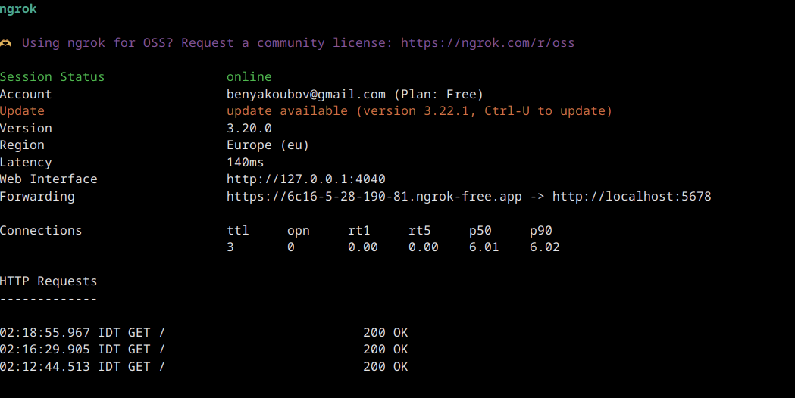
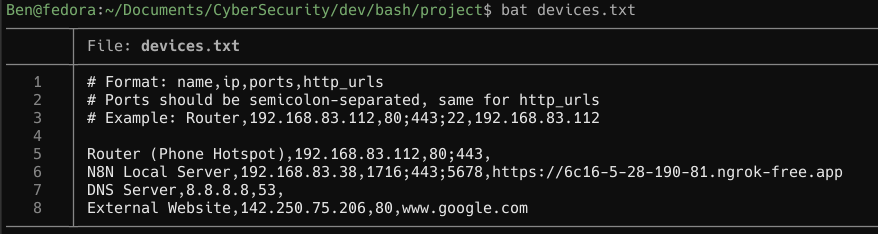
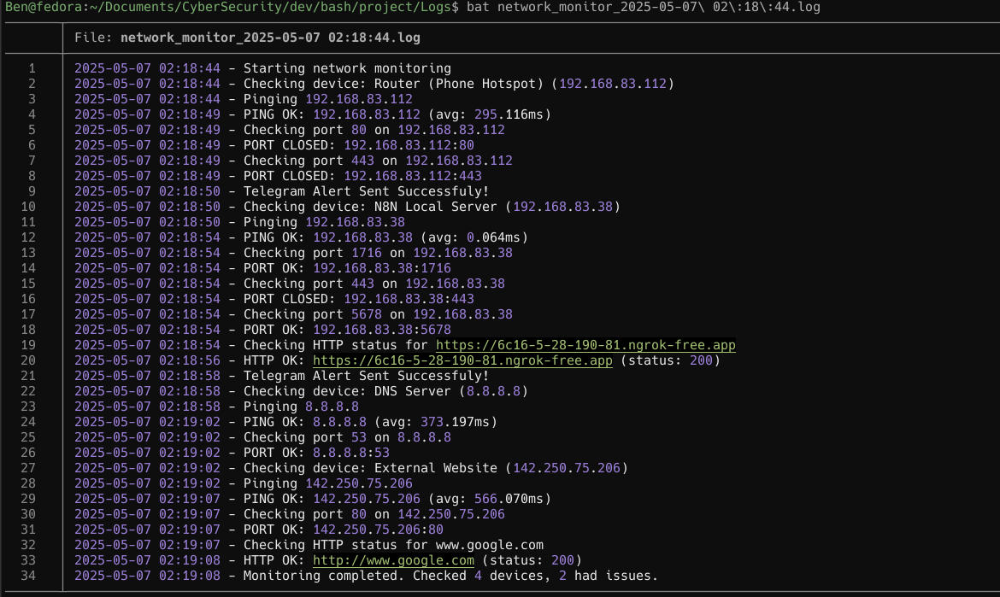

# Network Monitoring Bash Tool

A script designed for proactive network and service monitoring, This tool checks the health of specified network devices and services, providing real-time alerts via Telegram-bot for any detected issues.

**Watch a demonstration of the script in action:**

[NetworkMonitor-GIF](https://github.com/BenYak1/network-monitoring-bash-tool/blob/main/assets/NetworkMonitor.gif)

## Key Features

-   **Device Reachability**: Verifies if devices are online using `ping`.
-   **Port Status Monitoring**: Checks if specified TCP ports on target devices are open or closed.
-   **HTTP(S) Endpoint Validation**: Confirms that web services are responding with a `200 OK` status.
-   **Configurable Device List**: Easily manage target devices and services through a simple text file (`devices.txt`).
-   **Telegram Alerts**: Sends instant notifications to a specified Telegram chat for any detected anomalies.
    -   **HTML Formatted Alerts**: Alerts are styled using HTML for better readability in Telegram.
-   **Secure Credential Management**: Leverages an `.env` file to store sensitive information like API tokens and chat IDs.
-   **Colorful Console Logging**: Provides clear, color-coded (ANSI) status messages in the terminal for interactive monitoring.
-   **Detailed File Logging**: Maintains a persistent log file for each run, stored in the `Logs/` directory with a timestamp, for audit and review.
-   **Graceful Shutdown**: Handles `Ctrl+C` (SIGINT/SIGTERM) for clean script termination.

## How It Works

The script operates by reading a list of devices from `devices.txt`. For each device, it performs a series of checks:

1.  **Ping Check**: Sends ICMP echo requests to the device's IP address to confirm it's reachable and measures average response time.
2.  **Port Check**: Attempts to establish a TCP connection to each specified port on the device. It expects these ports to be open and alerts if they are found closed.
3.  **HTTP(S) Check**: For specified URLs, it sends an HTTP GET request and verifies if the response status code is `200 OK`. It automatically prepends `http://` if no scheme is provided. An example of this is checking a locally hosted N8N service exposed via ngrok, as demonstrated below:
    

If any of these checks fail, an alert message detailing the issue is constructed and sent via the Telegram Bot API. All actions and results are also logged to both the console and a dedicated log file.

## File Structure

```
.
├── network_monitor.sh    # The main monitoring script
├── devices.txt           # Configuration file for devices to monitor
├── .env                  # Environment variables (for API keys, etc.)
├── Logs/                 # Directory for storing run logs
│   └── network_monitor_YYYY-MM-DD HH:MM:SS.log
└── README.md             # This file
```

## Requirements

-   **Bash**: Version 4.0 or higher.
-   **curl**: For making HTTP requests (Telegram API, HTTP checks).
-   **ping**: (Usually part of `iputils` or similar) For ICMP checks.
-   **timeout**: (Usually part of `coreutils`) For connection timeouts during port checks.

Most Linux distributions come with these pre-installed or they can be easily installed via the system's package manager.

## Setup & Configuration

1.  **Clone or Download**:
    Get the script files onto your system. If using Git:
    ```bash
    git clone https://github.com/BenYak1/Network-Monitoring-Bash-Tool.git
    cd Network-Monitoring-Bash-Tool
    ```

2.  **Make the script executable**:
    ```bash
    chmod +x network_monitor.sh
    ```

3.  **Configure Devices (`devices.txt`)**:
    Create or edit the `devices.txt` file in the same directory as the script. Add one device per line using the following format:
    `name,ip_address,ports,http_urls`
    -   `name`: A descriptive name for the device/service.
    -   `ip_address`: The IP address or hostname of the device.
    -   `ports`: A semicolon-separated list of TCP ports to check (e.g., `80;443;22`). Leave blank if no port checks are needed.
    -   `http_urls`: A semicolon-separated list of HTTP/HTTPS URLs to check (e.g., `http://example.com;https://another.site`). Leave blank if no HTTP checks are needed.

    Below is an example of how the `devices.txt` file should be structured:
    

    **Example `devices.txt` content:**
    ```plaintext
    # Format: name,ip,ports,http_urls
    # Ports should be semicolon-separated, same for http_urls
    # Example: Router,192.168.83.112,80;443;22,192.168.83.112

    Router (Phone Hotspot),192.168.83.112,80;443,
    N8N Local Server,192.168.83.38,1716;443;5678,https://6c16-5-28-190-81.ngrok-free.app
    DNS Server,8.8.8.8,53,
    External Website,142.250.75.206,80,www.google.com
    ```

4.  **Configure Environment Variables (`.env`)**:
    Create an `.env` file in the same directory as the script. This file will store your Telegram Bot Token and Chat ID.
    ```ini
    TOKEN="YOUR_TELEGRAM_BOT_TOKEN"
    CHAT_ID="YOUR_TELEGRAM_CHAT_ID"
    ```
    Replace `YOUR_TELEGRAM_BOT_TOKEN` with your actual Telegram bot token and `YOUR_TELEGRAM_CHAT_ID` with the target chat ID.
    *Note: The script automatically sources this `.env` file.*

## Usage

To run the monitoring script:
```bash
./network_monitor.sh
```
The script will output colored status messages to the console and log all activities to a file in the `Logs/` directory. Alerts for any detected issues will be sent to your configured Telegram chat.

### Scheduling with Cron (Optional)

For continuous monitoring, you can schedule the script to run at regular intervals using `cron`.
Open your crontab for editing:
```bash
crontab -e
```
Add a line similar to the following to run the script every 5 minutes (adjust as needed):
```cron
*/5 * * * * /path/to/your/script/network_monitor.sh
```
Replace `/path/to/your/script/` with the actual absolute path to `network_monitor.sh`.

## Alerting

-   **Mechanism**: Uses `curl` to send POST requests to the Telegram Bot API.
-   **Format**: Messages are formatted with HTML for improved readability (e.g., bold headers, underlined sections).
    ```html
    <u><b>Network Monitoring Alert</b></u>

    Device: [Device Name] ([Device IP])

    <u><b>Issues detected</b></u>:
    - [Issue 1]
    - [Issue 2]

    Time: [YYYY-MM-DD HH:MM:SS]
    ```
-   **Triggers**: Alerts are sent if:
    -   A device fails the ping check.
    -   A specified port is found to be closed.
    -   An HTTP/HTTPS endpoint does not return a `200 OK` status.

## Logging

The script implements two types of logging:

1.  **Console Logging**:
    -   Uses ANSI escape codes for colored output:
        -   `[INFO]` (Blue)
        -   `[OK]` (Green)
        -   `[WARN]` (Yellow)
        -   `[ERR]` (Red)
    -   Provides immediate feedback on the script's operations.

2.  **File Logging**:
    -   A new log file is created in the `Logs/` directory for each execution, named `network_monitor_YYYY-MM-DD HH:MM:SS.log`.
    -   The `Logs/` directory is created automatically if it doesn't exist.
    -   Each log entry is timestamped.
    -   Records all checks, successes, failures, and alert statuses.

Here's an example of the script's log output from a run:




## License

This project is licensed under the MIT License. See the [LICENSE](LICENSE) file for details.

## Author

Ben Yakoubov
